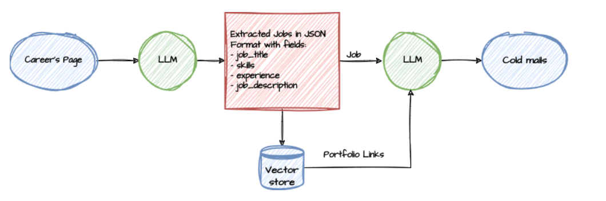
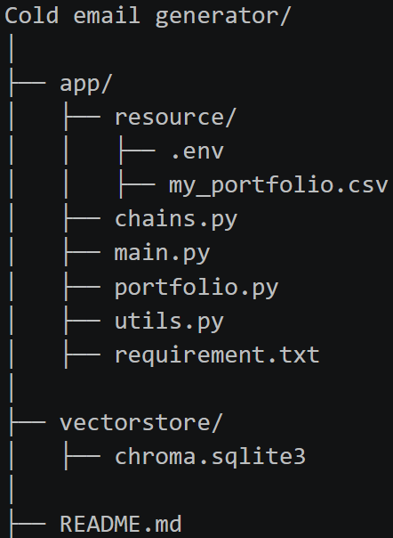
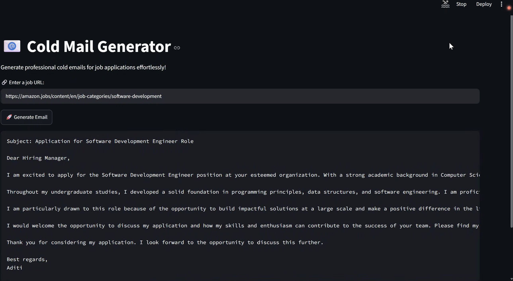

Cold Email Generator

Overview:

The Cold Email Generator is a Generative AI‑powered application that automatically creates professional job application emails based on job postings.

It uses LangChain, Groq’s Llama 3.3 model, and Streamlit to extract job details from career pages and generate personalized cold emails for Computer Science‑related roles.

Features:

1.Scrapes job descriptions directly from career websites.

2.Extracts structured data (role, experience, skills, description) using Groq LLM.

3.Matches relevant portfolio links via ChromaDB vector search.

4.Generates polished, professional cold emails automatically.

5.Interactive Streamlit UI with real‑time generation and error handling.

Tech Stack:

Python 3.13 --> Core language

Streamlit --> Front‑end interface

LangChain + Groq API --> LLM integration

ChromaDB --> Portfolio vector storage

pandas --> CSV data handling

dotenv --> Secure API‑key management

Groq’s Llama 3.3 model LLM is used as the intelligence layer in my project. It does two main things:

1.Understanding job postings:

The scraped text from a careers page is passed into Groq LLM.
Using prompt instructions, the model identifies key details (role, experience, skills, description).
It outputs this information in structured JSON format, which makes it easy for the app to process.

2.Generating cold emails:

The structured job data plus portfolio links are fed into Groq LLM with a second prompt.
The model then composes a professional, tailored email that highlights the background and skills.
The output is plain text, ready to display in Streamlit.

## Block Diagram

## File Structure

Workflow:

1.User Input -> Paste job posting URL
2.Scraping & Cleaning -> Extract and preprocess text
3.Job Extraction -> Groq LLM converts text into structured JSON
4.Portfolio Matching -> ChromaDB finds relevant links
5.Email Generation -> Groq LLM writes professional cold email
6.Display -> Streamlit shows the final email

## Generated Email Example

Future Improvements:

1.Add tone/style selector (Formal, Friendly, Confident).

2.Enable multiple job URLs at once.

3.Integrate resume upload and automatic attachment.

4.Deploy on Streamlit Cloud or Azure.

Author
Aditi Phulre  
Cold Email Generator – Powered by LangChain & Groq LLM